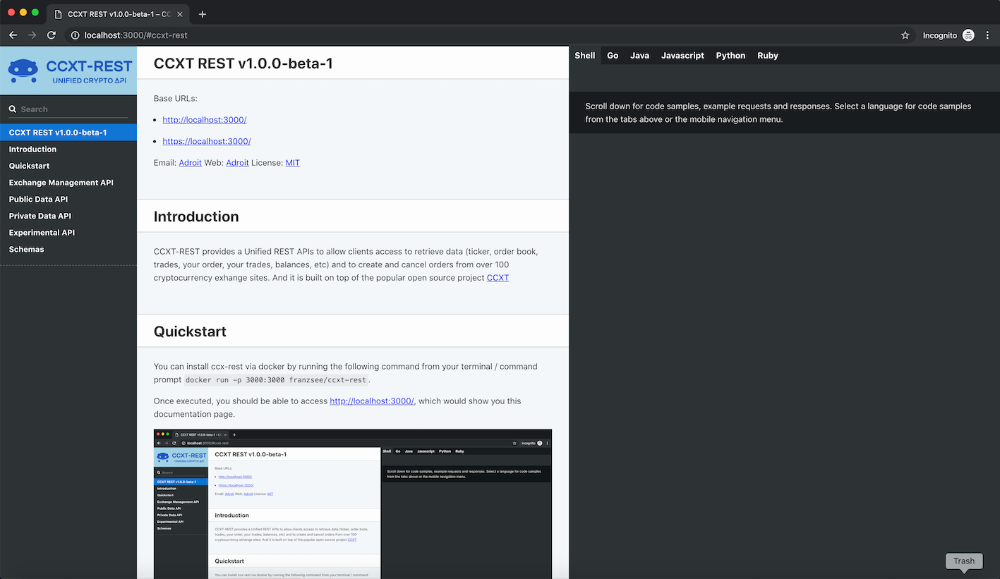
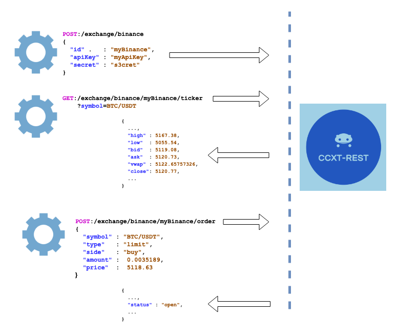

# Quickstart

You can install ccx-rest via docker by running the following command from your terminal / command prompt `docker run -p 3000:3000 franzsee/ccxt-rest`.

Once executed, you should be able to access [http://localhost:3000/](http://localhost:3000/), which would show you this documentation page.

And best of all, you can then start invoking API calls to your server to start getting data and trading!

